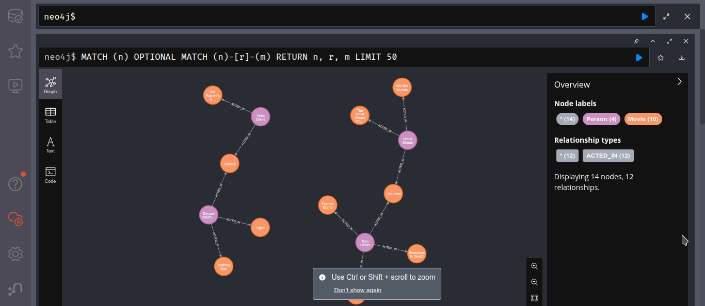
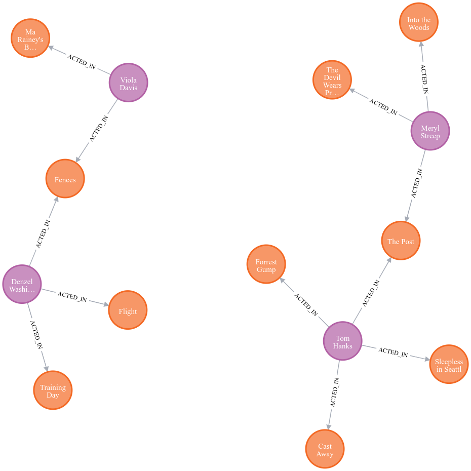

# 🎥 Neo4j Movie Graph Setup & Python Data Load

This repository contains the setup and Python scripts used to run a Neo4j database via Docker, resolve initial connection security issues, and populate a simple graph dataset modeling Actors and Movies.

## 🚀 Prerequisites

Before you begin, ensure you have the following installed on your system:

1. **Docker:** For running the Neo4j database container.

2. **Python 3.x:** For executing the data loading script.

3. **Neo4j Python Driver:** Install the required library:

   ```bash
   pip install neo4j
   
## 1\. Setting up the Neo4j Container

We use the official Neo4j 2025.08.0 Docker image. This command starts the database, enables automatic restarts, and maps the database files to a local folder for persistence.

### 1.1. Run the Container

Execute the following command, making sure to replace the volume path (`/path/to/database_dir`) with your desired host directory.

```bash
sudo docker run \
    --name neo4j-movie-db \
    --restart always \
    --publish=7474:7474 \
    --publish=7687:7687 \
    --volume=/path/to/database_dir:/data \
    neo4j:2025.08.0

```

| **Port** | **Purpose** |
| :--- | :--- |
| **7474** | HTTP/Web Interface (Neo4j Browser) |
| **7687** | Bolt Protocol (Python Driver Connection) |

### 1.2. Resolving the Write Permission Warning

Upon running, Docker may generate a warning if the host folder permissions (`/data`) do not match the internal container user ID. The Neo4j entrypoint script automatically resolves this by changing the folder owner inside the container.

## 2\. Initial Security & Password Change

The Neo4j container starts with a mandatory security policy requiring an immediate password change for the default user (`neo4j`).

The initial connection attempt with the default password (`neo4j`) will fail, returning a `CredentialsExpired` error.

### 2.1. The Password Change Script

We use the Neo4j Python driver to connect to the special **`system`** database and execute the password change query.

> **Crucial Step:** You must update the `NEW_PASSWORD` variable in your script (`neo4j_data_script.py`) to the new secure password you chose.

The underlying Cypher command used is:

```cypher
ALTER CURRENT USER SET PASSWORD FROM 'neo4j' TO 'MySecureNewPassword123'

```

## 3\. Populating the Graph Data

The Python script `neo4j_data_script.py` connects to the secured database, clears any old data, and executes a large Cypher transaction to create the graph model.

### 3.1. Data Model

The script creates nodes and relationships representing a small movie dataset:

  * **Node Labels:** `:Person`, `:Movie`

  * **Relationship Type:** `:ACTED_IN` (with an optional `role` property)

### 3.2. Execution

Run the script from your terminal:

```bash
python neo4j_data_script.py

```

**Expected Output:**

```
Connecting to Neo4j at neo4j://localhost:7687...
Cleared existing graph data.

Successfully added 10 Movie nodes and associated relationships.

--- Graph Schema Summary (Schematic) ---
Node Labels Found: Person, Movie
Relationship Types Found: ACTED_IN
-----------------------------------

Connection closed.

```

## 4\. Visualization (Plotting the Graph)

The best way to "plot" the graph is by using the Neo4j web-based visualization tool, the **Neo4j Browser**.

1.  **Access the Browser:**
    Open your web browser and go to:

    ```
    http://localhost:7474

    ```

2.  **Log In:**
    Use the username `neo4j` and your new secure password (`MySecureNewPassword123`).

3.  **Run the Visualization Query:**
    Execute the following Cypher query to retrieve and render the created graph structure:

    ```cypher
    MATCH (p:Person)-[r:ACTED_IN]->(m:Movie)
    RETURN p, r, m
    LIMIT 25

    ```
    This will display the nodes (Actors and Movies) connected by relationships, visually representing your data model.</br>
    To see the full detail:
    ```cypher
    MATCH (n)
    OPTIONAL MATCH (n)-[r]-(m)
    RETURN n, r, m
    LIMIT 50
    ```   
<!-- end list -->

```
```
## Output
`http://localhost:7474/browser/`

## Final Graph

